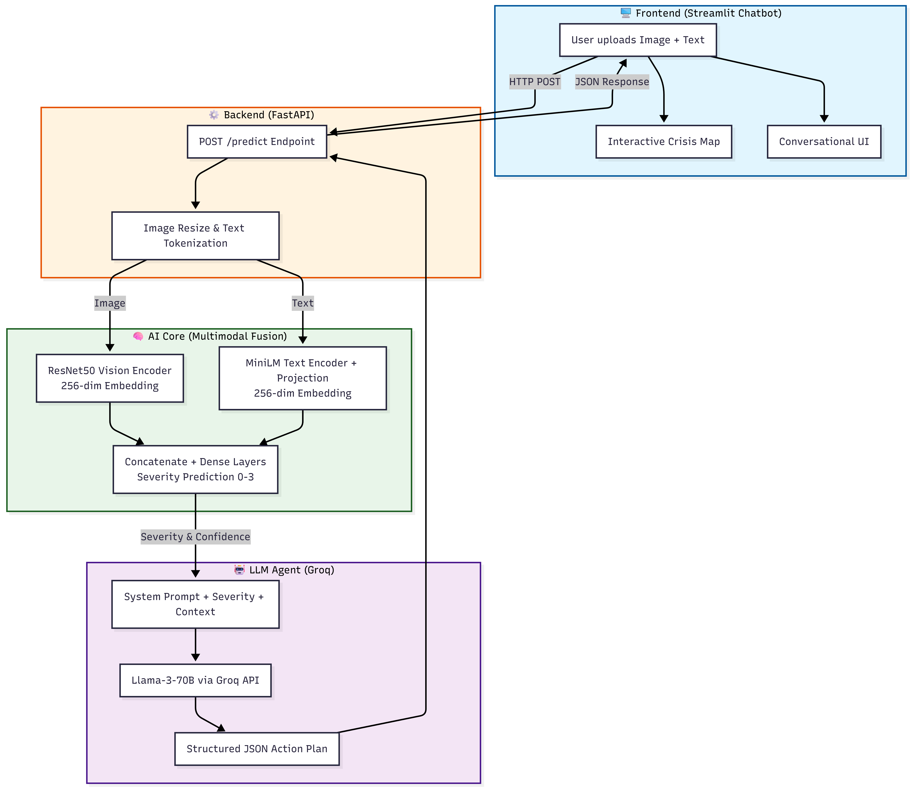

# 🚨 CrisisSight — Multimodal AI for Disaster Damage Assessment

> Upload a disaster image + a ground report → get a severity classification (Normal / Minor / Major / Critical) and an LLM-generated action plan with resources and response times.

<!-- TODO: add 2–3 screenshots here (chat UI showing a Critical assessment + probability chart) and a demo GIF -->


[](LICENSE)

🎥 **Demo video:** <!-- TODO: upload to YouTube (unlisted is fine) and paste the link, or delete this line -->

## Overview

CrisisSight is an end-to-end prototype that fuses **computer vision** and **NLP** for first-pass disaster triage:

1. **Frontend** — Streamlit chatbot: image upload, severity badges, probability charts, action plans.
2. **API** — FastAPI service that preprocesses inputs, runs the fusion model, and orchestrates the LLM agent.
3. **AI core** — Frozen ResNet50 (vision) + MiniLM (text) encoders projected to 256-d each, concatenated and fused by dense layers into a 4-class severity prediction.
4. **LLM agent** — Groq-hosted model receives the severity context + ground report and returns a structured JSON action plan (validated parsing, retries, rate-limit handling, rule-based fallback if the LLM is unavailable).

## Architecture


<!-- NOTE: rename the file docs/Architecture_diagram.png → docs/architecture_diagram.png (lowercase) so this renders on GitHub -->

```
User input (image + text report)
        │
        ├──► ResNet50 (frozen, ImageNet) ──► Dense ──► 256-d vision embedding
        │
        └──► MiniLM-L6-v2 (frozen) ──► 384-d ──► projection ──► 256-d text embedding
                                            │
                                   Concatenate (512-d)
                                            │
                              Dense(256) → Dropout → Dense(128) → Dropout
                                            │
                                   Softmax → severity class
                                            │
                    Groq LLM agent → JSON action plan (with fallback)
                                            │
                                   Streamlit chat UI
```

## Results (read honestly)

| Component | Data | Metric |
|---|---|---|
| Vision encoder | AIDER disaster images (real, 4 classes: collapse / fire / flood / normal) | **78% val accuracy** |
| Fusion model | 700 **synthetic** image–text pairs | 99.8% val accuracy — see caveat below |

> ⚠️ **On the fusion number:** the synthetic text reports were generated from per-severity templates, so text content correlates almost perfectly with the label — the fusion model can score highly by relying on the text channel alone. This is a known limitation of the synthetic pair construction, not evidence of a strong multimodal model. The 78% vision accuracy on real images is the metric we trust; improving fusion training data (real image–report pairs) is the top item on the roadmap.
<!-- TODO (strongly recommended): run a quick ablation — fusion accuracy with the text input zeroed/shuffled vs. normal — and add the two numbers to the table. Diagnosing leakage yourself is a strength signal in interviews. -->

## Tech stack

TensorFlow 2.15 / Keras · ResNet50 (ImageNet, frozen) · `all-MiniLM-L6-v2` (sentence-transformers, frozen) · FastAPI + Uvicorn · Groq LLM API (JSON mode) · Streamlit · pandas / Pillow

## Project structure

```
api/main.py                 # FastAPI service: /predict, /health (Pydantic response models)
agent/crisis_agent.py       # Groq LLM agent: JSON action plans, retries, fallbacks
frontend/app.py             # Streamlit chat UI
src/
  vision/train.py           # ResNet50 encoder + classification head training (AIDER)
  vision/dataset.py         # tf.data pipeline for image folders
  nlp/train.py              # MiniLM smoke test + 384→256 projection layer
  fusion/create_pairs.py    # builds synthetic image–text training pairs
  fusion/train.py           # trains the concat-fusion severity model
scripts/
  test_api.py               # end-to-end API test (health + predict)
  list.py                   # list available Groq models for your key
  create_sample_tweets.py   # small sample text dataset for smoke tests
docs/                       # architecture diagram, demo assets
```

## Quickstart

### Prerequisites
Python 3.10 (TensorFlow 2.15 constraint) · a free [Groq API key](https://console.groq.com)

### 1. Install

```bash
git clone https://github.com/nishant-netizen524/CrisisSight.git
cd CrisisSight
conda create -n crisissight python=3.10 -y && conda activate crisissight
pip install -r requirements.txt
```

### 2. Configure

```bash
cp .env.example .env
```

```env
GROQ_API_KEY=your_groq_api_key_here
GROQ_MODEL=llama-3.1-8b-instant     # any model id from `python scripts/list.py`
LLM_PROVIDER=groq
```

### 3. Get data & train models

The trained `.h5` models are not committed (size). Either train them (~30 min on CPU for the fusion head; vision encoder training depends on your hardware) or download pre-trained weights: <!-- TODO: host the 3 .h5 files on Hugging Face Hub / Google Drive and add scripts/download_models.py, or delete this sentence -->

```bash
# a) Download the AIDER dataset (Zenodo) into data/AIDER_Images/{collapse,fire,flood,normal}
#    and the Kaggle Disaster Tweets dataset into data/DisasterTweets/train.csv
#    (TODO: restore a scripts/download.py that does this automatically — kagglehub is already a dependency)

# b) Train in dependency order:
python src/nlp/train.py            # → models/text_projection_layer.h5
python src/vision/train.py         # → models/vision_encoder.h5, models/vision_classifier.h5
python src/fusion/create_pairs.py  # → data/fusion_{train,val}_pairs.csv
python src/fusion/train.py         # → models/fusion_model.h5
```

### 4. Run

```bash
# Terminal 1 — API (loads models once at startup):
python api/main.py                 # http://localhost:8001  (Swagger docs at /docs)

# Terminal 2 — UI:
streamlit run frontend/app.py --server.port 8502
```

Open http://localhost:8502, upload a disaster image, and type e.g. *"Massive flooding, people trapped on rooftops"*.

### 5. Test

```bash
python scripts/test_api.py
```

## Limitations & roadmap

- Fusion training data is synthetic → text-channel leakage (see Results); real image–report pairs (e.g., CrisisMMD, disaster social-media corpora) are the priority.
- The 384→256 text projection is randomly initialized and frozen, not trained end-to-end.
- English-only text; no GPS/EXIF extraction; images only (no video).
- Next: text-ablation study, batched inference for high-throughput feeds, containerized deployment, incident map in the UI.

## Team

<!-- TODO: replace with real names + who built what, or remove this section if solo.
     Keep it consistent with your resume — interviewers will ask "which part was yours?" -->
- **Nishant Saini** — …
- **Teammate name** — …

## License

MIT — see [LICENSE](LICENSE).

## Acknowledgments

- [AIDER dataset](https://zenodo.org/) ( disaster image classification)
- [Disaster Tweets dataset](https://www.kaggle.com/datasets/philculliton/nlp-getting-started-tutorial) (Kaggle)
- [Groq](https://groq.com) — free-tier LLM inference
